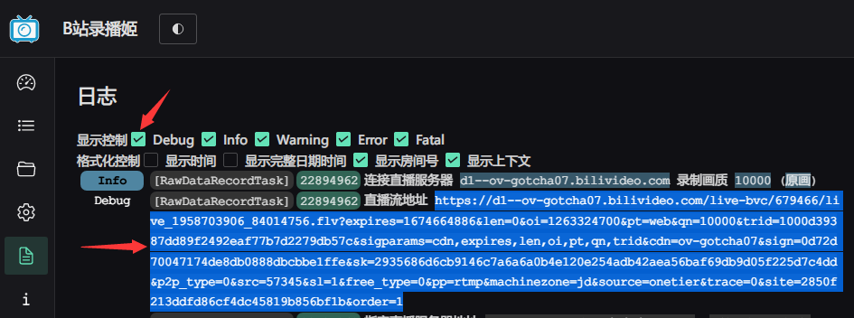

# Bilibili直播自动追帧

https://greasyfork.org/zh-CN/scripts/453967

**从0.4.2版本更新时建议删除脚本后重新安装**

## 主要功能

对bilibili的直播进行追帧以实现低延迟的直播播放，从而提供近乎实时的弹幕互动、或是用于同传追帧等

脚本加载后，会在直播界面右上方粉丝团处生成配置项，可以根据网络情况设定追帧的目标缓存时长

## 次要功能

- 0.6.6
    - 自定义API：可以自定义获取playurl所用的API endpoint：https://github.com/c-basalt/bilibili-live-seeker-script/issues/1
- 0.6.3
    - 重置音画同步：（实验）让音视频重新定位来尝试重置音视频的不同步，并提供定时自动重置
- 0.6.2
    - 设置链接：支持直接使用完整的直播流flv链接，如使用B站录播姬日志中的“直播流地址”。

- 0.5.6
	- 自动刷新：（添加行为）在下播期间检测到弹幕一直无变化，且开启了“阻止轮播”时，自动刷新网页
- 0.5.3
	- 自动原画：自动选择最高画质
	- 避免暂停：自动恢复暂停的直播流为播放状态，避免因暂停导致直播流重新加载
	- 强制原画/复制链接/设置链接：当前B站直播已经会对“原画”进行二压，开播约10秒-1分钟后获取的“原画”均为不高于6Mbps的二压推流，会**额外产生2-3秒量级的延迟**。刚开播时可以获取`live_000000_0000.flv`链接格式的真实原画推流，而之后的“原画”只能获取`live_000000_0000_bluray.flv`链接格式的二压推流 
	新添加的功能可以缓存开播时获取的真实原画链接（有效期1小时，但不刷新可一直使用），并拦截浏览器的请求，避免浏览器使用二压推流。如果开播前没有开启浏览器直播间，则可以通过“设置链接”来添加有效的原画链接信息（[示例](http://oss.cbasalt.ml/public/playurl.txt)，[其他示例](http://oss.cbasalt.ml/public/playurls.html)）
	- 阻止轮播：自动阻止直播间轮播，方便提前开启直播间页面待机，以获取原画推流降低延迟
- 0.4.2
	- 强制avc+flv：强制采用HTTP-FLV协议，并使用H264(AVC)码流，从而避免HLS协议/H265(HEVC)转码带来的额外延迟
	- 自动刷新：（未充分测试）直播期间检测到直播间连接失败信息时、下播状态下主播开播后没有自动开始播放直播时（每3分钟检测一次，推测是和弹幕服务器连接断开导致），自动刷新网页
	- 缓存时长极低时降低播放速度

## 需求和问题反馈

可以[通过B站联系我](https://space.bilibili.com/521676)，但修不修看我个人兴趣。建议直接自己动手更快

## 原理

简单的说，实时的视频流直播不可避免的会有网络波动的问题，因而**画质**、**稳定性**、**延迟**只能三选二。
对于直播平台这种面向多数人的内容的直播，一般会优先画质和稳定性，即保持良好画质的同时，尽可能保证播放的流畅，避免频繁的卡顿加载影响体验。

所以在实际播放直播的视频推流的时候，播放器并不是立刻播放从服务器收到的视频流，而是会在本地缓存4-20秒的时长。这样即便有网络波动，只要波动在缓存时长的范围内，对于用户而言就是无感的，从而可以保证大部分环境下的流畅的直播观看体验。但是其代价则是视频流必须经过数秒的缓存才会播放，这就给直播的播放带来了等同于缓存时长的延迟。而事实上网络稳定时，绝大部分的延迟都是在本地缓存产生的。

追帧脚本则是通过HTML5播放器的HTMLMediaElement.playbackRate API来控制播放的速率，在缓存过长时加速播放，提前播放视频流消耗本地缓存，从而减少由于本地缓存带来的延迟。换言之，就是放弃播放的稳定性，来换取播放的低延迟。事实上使用稳定的PC网络播放直播时，出现大幅波动的情况并不多，即便相对激进地设置1.0-1.5秒的延迟，也能大部分时间获得流畅的直播。并且由于追帧后的低延迟，发送的弹幕几乎可以同步地出现在画面的弹幕机上，直播的交互体验可以大幅地提升。

在bilibili直播中常见的同传，其基础也是各自采用的追帧工具。通过追帧，同传man可以实现远低于一般观众的本地延迟，相同的内容可以比一般观众早4-10秒看到。这个延迟的时间差构成了同传的基础，即只要同传man在这4-10秒内完成打字翻译，那么在其他观众看来，同传弹幕就是和主播的语音同时、甚至更早出现的。
